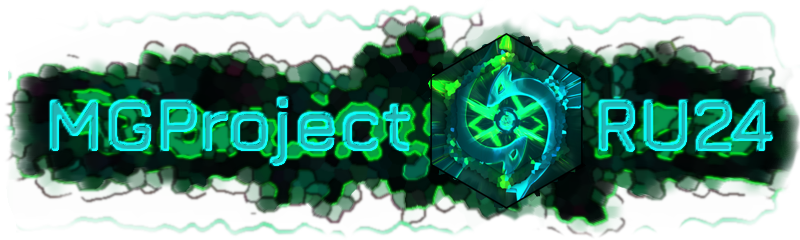

#  MGProjectRU / Marketplace Eco Habits

Главные модули системы:

- Accounts - используется для управления пользователями, регистрация и авторизация. Использование почты для информирования
- Marketplace - Реализация функционала получения бонусов от партнёров, отвечает за страницу для пользователей, и за страницу партнёров
- EcoWallet - Реализация функционала валюты, получение и её трата
- About - Информирование, новости, главная, рейтинги и т.д.
- Events - Реализация событий, коэффициент, открытие новых заданий, типы эко-трекеров
- Trackers - Трекеры, отслеживают за выполнением экологических привычек, реализация привычек

## Реализация

### About

Страницы:

- Главная (`main`) ()

### Administrations

Страницы:

- Базовая админ панель () (`sysadmin/`) - Надо сделать новую страницу и переход авто на дешборд администратора...
- Управление пользователями (частично, реализовано, нужно решить проблемные сценарии)
- Управление заявками на регистрацию (модель и вьюха с реализацией есть!)
- Управление проверкой выполнения заданий (надо сделать так, чтобы был определённый тип для заданий, который автоматически приходит ему (сортировка по типу) после одобрения только приходит уведомление )
- Управление проверкой ИИ (анализ выполнение проверки) (Добавить модели для этого всего)

### Accounts

Страницы:

- 'login/', name="login" (Auth)
- "logout/", name=""

### Index

Страницы:

- 

Роли:
- "Участники", 
- "Руководители", 
- "Администраторы", 
- "Контент менеджер"
- "Партнеры"